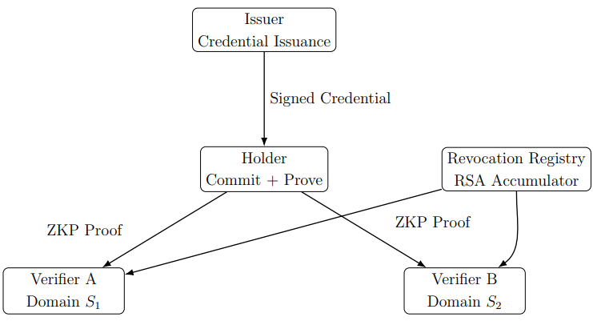
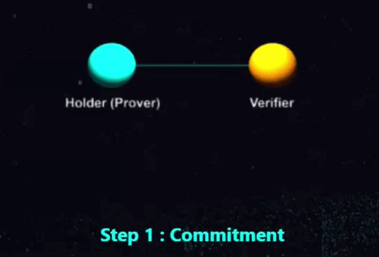
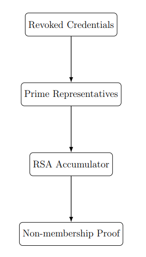
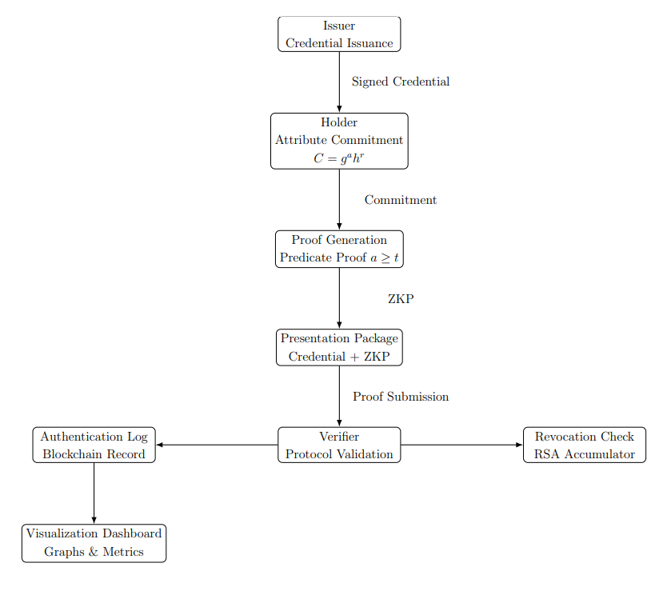

# ZKP-Based Multi-System Attribute Verification  
### Privacy-Preserving Credential Framework with Revocation


> Research Prototype | Cryptography | Zero-Knowledge Proofs

>  A modular, end-to-end implementation of a zero-knowledge credential system enabling privacy-preserving verification, scoped unlinkability, and efficient revocation.

---

## Academic Integrity Notice

This repository contains original research work developed by **Sayan Bairagi**.

Any use of this work in academic, research, or professional contexts must include proper attribution and citation.

Unauthorized copying, plagiarism, or submission of this work without appropriate credit is strictly prohibited and may constitute academic misconduct.

---

## System Architecture

<p align="center">
  
</p>

<p align="center">
  <em><b>Figure 1: High-level architecture of the ZKP-based multi-system attribute verification framework, illustrating issuer, holder, verifiers, and revocation registry interactions.</b></em>
</p>

---

## ZKP Protocol Animation (Σ-Protocol)



<em><b>Figure 2: Animated visualization of the zero-knowledge protocol showing commitment, challenge, and response phases.</b></em>

---

## System Highlights

- No trusted setup required
- Constant-size revocation proofs
- Fully transparent cryptographic design
- Practical and benchmarked implementation
- Scoped unlinkability across domains
---

## 1. Executive Overview

This repository contains a complete and operational prototype of a zero-knowledge credential system designed for privacy-preserving, multi-system attribute verification.

The system enables a user to prove predicates over committed attributes (e.g., age ≥ threshold) to multiple independent verifiers while ensuring:

- Selective disclosure
- Scoped unlinkability across verification domains
- Efficient revocation via RSA accumulators
- Practical performance under 2048-bit security parameters

The implementation is fully functional, modular, benchmarked, and reproducible.

---

## Key Features

- Selective disclosure of attributes  
- Scoped unlinkability across verifiers  
- Efficient RSA accumulator-based revocation  
- Range proofs for predicate verification  
- Modular layered architecture

---

## 2. Security Foundations

System security reduces to standard assumptions:

- **Discrete Logarithm Assumption**
- **Strong RSA Assumption**
- **Random Oracle Model (Fiat–Shamir transformation)**

Design intentionally avoids:

- Trusted setup
- Pairing-based cryptography
- SNARK-style heavy proof systems

All constructions rely on classical modular arithmetic and transparent primitive composition.

---

## 3. Implemented Cryptographic Components

### Commitment & Identity

- Pedersen commitments
- Scoped pseudonym derivation
- Decentralized Identifier (DID) abstraction
- Verifiable Credential structure

### Signature & Proof System

- Schnorr signature scheme
- Non-interactive sigma protocols
- Range proof implementation (`range_proof.py`)
- Merkle tree support (`merkle.py`) for structured commitments

### Group & Parameter Generation

- Safe prime generation (`safe_prime.py`)
- Prime-order subgroup construction (`group.py`)
- Domain-separated hashing (`hash_utils.py`)
- System parameter configuration (`parameters.py`)

### Revocation System

<p align="center">
  
</p>

<p align="center">
  <em><b>Figure 3: RSA accumulator-based revocation mechanism demonstrating mapping of credentials to prime representatives and efficient non-membership proof generation.</b></em>
</p>


- RSA modulus generation (`rsa_setup.py`)
- RSA accumulator (`accumulator.py`)
- Membership proofs (`membership.py`)
- Non-membership proofs (`non_membership.py`)
- Prime representative mapping (`prime_representative.py`)

### Ledger Layer

- Block abstraction (`block.py`)
- Blockchain state management (`chain.py`)

Provides tamper-evident anchoring of revocation or credential events.

### Benchmarking Framework

- Prover time measurement
- Verifier time measurement
- Revocation scalability testing
- Statistical stability analysis

---

## 4. Repository Structure

```
ZKP_MultiSystem_Verification/
backend/
│
├── main.py                     # End-to-end execution pipeline
├── config.py                   # Global configuration
├── server.py
├── demo_state.py
├── requirements.txt
├── README.md
│
├── benchmarks/
│   └── benchmark.py
│
├── blockchain/
│   ├── block.py
│   └── chain.py
│
├── crypto/
│   ├── group.py
│   ├── hash_utils.py
│   ├── merkle.py
│   ├── parameters.py
│   ├── pedersen.py
│   ├── pseudonym.py
│   ├── range_proof.py
│   ├── safe_prime.py
│   ├── schnorr.py
│   └── signature.py
│
├── holder/
│   └── holder.py
│
├── identity/
│   ├── did.py
│   └── vc.py
│
├── issuer/
│   └── issuer.py
│
├── revocation/
│   ├── accumulator.py                # RSA accumulator logic
│   ├── membership.py                 # Membership proofs
│   ├── non_membership.py             # Revocation proofs
│   ├── prime_representative.py       # Mapping logic
│   └── rsa_setup.py                  # RSA parameter generation            
│
└── verifier/
|    └── verifier.py
|
frontend/
|
├── animation.html
├── forgot.html
├── index.html
├── login.html
├── register.html
├── firebase.js
├── firebase.json
├── firestore.indexes.json
├── package.json
├── .firebaserc
|
functions/
```

---

## 5. Architectural Design

The system is structured into logical layers:

### 1. Cryptographic Primitive Layer (`crypto/`)
Implements reusable low-level primitives:
- Group operations
- Commitment schemes
- Signature schemes
- Range proofs
- Hash utilities
- Prime generation

### 2. Protocol Layer (`issuer/`, `holder/`, `verifier/`)
Implements:
- Credential issuance
- Predicate proof generation
- Scoped verification
- Replay protection

### 3. Revocation Layer (`revocation/`)
Implements RSA accumulator-based revocation with:
- Constant-size witnesses
- Non-membership verification independent of revoked set size

### 4. Identity Layer (`identity/`)
Implements:
- DID abstraction
- Credential encoding

### 5. Ledger Layer (`blockchain/`)
Provides tamper-evident event anchoring.

### 6. Evaluation Layer (`benchmarks/`)
Measures:
- Prover cost
- Verifier cost
- Scalability
- Statistical stability

Each layer is cleanly separated to maintain auditability and extensibility.

---

## System Workflow

1. Issuer generates system parameters and issues credentials  
2. Holder commits attributes and generates zero-knowledge proofs  
3. Verifier checks proof validity without learning sensitive data  
4. Revocation system ensures credential validity via accumulator  
5. Blockchain layer anchors events for tamper-evidence

---

## Quick Start

```bash
pip install -r requirements.txt
python main.py
```


## 6. Execution

### Requirements

- Python 3.10+


Execution flow:

1. System parameter generation
2. Credential issuance
3. Predicate proof generation
4. Scoped verification
5. Revocation verification
6. Reuse detection
7. Benchmark evaluation
8. Scalability analysis

---

## ZKP Verification Pipeline

<p align="center">
  
</p>

<p align="center">
  <em><b>Figure 4: End-to-end zero-knowledge verification pipeline showing credential issuance, commitment generation, proof construction, and verifier validation.</b></em>
</p>

---

## 7. Performance Characteristics

Under 2048-bit security parameters:

- Verification latency remains in the millisecond range
- Revocation verification cost independent of revoked set size
- Presentation size ≈ 3 KB
- RSA exponentiation dominates prover cost (expected under Strong RSA)

No trusted setup required.

---

## 8. Design Philosophy

The architecture separates:

- Privacy-first architecture
- Modular and extensible design
- Cryptographic transparency
- Primitive implementation
- Protocol logic
- Identity abstraction
- Revocation management
- Ledger anchoring
- Benchmarking
- Real-world applicability

This disciplined modularity enables:

- Transparent security reasoning
- Reproducibility
- Extension in Phase II
- Clean formal modeling in future work

---

## 9. Status

  - Fully implemented  
  - End-to-end operational  
  - Benchmarked  
  - Modular  
  - Extensible  

This repository presents a fully functional cryptographic system built on standard assumptions, avoiding reliance on opaque or trusted-setup-based proof systems.

---

## 10. Use Cases

- Privacy-preserving digital identity systems 
- Anonymous authentication protocols  
- Blockchain-based identity verification  
- Secure multi-system access control

---


## Citation
Please provide proper attribution when referencing this work.

If you use this work in research, publications, or projects, please cite:

> **Sayan Bairagi** (2026).  
> *ZKP-Based Multi-System Attribute Verification Framework with Revocation*.  
> GitHub Repository.  
> Available at: https://github.com/sayan-hi/zkp-credential-framework  

---

### BibTeX

```bibtex
@misc{bairagi2026zkp,
  author       = {Sayan Bairagi},
  title        = {ZKP-Based Multi-System Attribute Verification Framework with Revocation},
  year         = {2026},
  howpublished = {https://github.com/sayan-hi/zkp-credential-framework},
  note         = {Available at: https://github.com/sayan-hi/zkp-credential-framework}
}
```

---


## License

This project is licensed under the **GNU General Public License v3.0 (GPL-3.0)**.

You are free to use, modify, and distribute this work under the terms of the GPL-3.0 license.  
However, any derivative work must also be distributed under the same license and must provide proper attribution to the original author.

For full license details, see the [LICENSE](./LICENSE) file.

© 2026 Sayan Bairagi. All rights reserved.

---

## Author

**Sayan Bairagi**

B.Tech Computer Science


GitHub: https://github.com/sayan-hi
