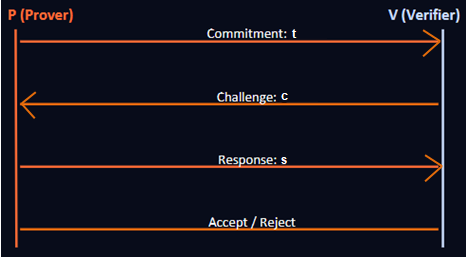

# System Architecture

## Overview

This work presents a **privacy-preserving, multi-domain credential verification framework** based on zero-knowledge proofs (ZKPs), enabling users to prove statements over committed attributes without revealing the underlying values.

Concretely, user attributes are encoded as commitments of the form C = gα hβ in a cyclic group G of prime order q, where α represents the secret attribute and β is randomness. Using these commitments, the system supports efficient zero-knowledge proofs of knowledge (PoK) for verifying algebraic relations over hidden data.

The framework achieves **strong privacy, security, and scalability guarantees**, including unlinkability across domains, replay resistance, and efficient revocation mechanisms.

The architecture follows a **modular, cryptographically rigorous design**, grounded in standard hardness assumptions such as the Discrete Logarithm assumption in G and Strong RSA assumptions. It avoids trusted setup dependencies, opaque proof systems and relies on transparent Σ-Protocol constructions to ensure transparency and auditability.

Beyond theoretical soundness, the system explicitly addresses **practical deployment challenges**, including scalable issuer trust management, privacy-preserving multi-verifier interactions, and long-term cryptographic resilience, making it suitable for real-world identity and credential systems.

The design ensures that no verifier learns anything beyond the validity of the asserted statement.

---

## The Centralized Identity Model (Conventional Systems)

   

Privacy Impact: Every verification exposes MORE data than necessary - creating a trail across systems.

"The system reveals everything when it only needs to reveal a single fact."

---

## Why Conventional Techniques Fail?

### Approach 1: Direct Document Sharing

[User (Has identity documents) → Scans (Creates digital copies) → Sends (Uploads to verifier) → Verifier (Receives & stores all data)]

**PROBLEMS WITH THIS APPROACH**

  - Full data exposure -every field, every document is shared
  - Documents can be stored indefinitely without consent
  - Forgery risk -verifier cannot cryptographically verify authenticity
  - No attribute selection - cannot share just one fact
  - Easy to correlate across verifiers via identical documents
  - User has zero control after the document leaves their hands
    
---

### Approach 2: Centralized Identity (OAuth / SSO)

   

**PROBLEMS**

  - Single point of failure - one breach exposes ALL
  - IdP sees ALL your activity across every service
  - Provider can link all your sessions over time
  - Trust concentration in one corporate entity
  - IdP can be coerced by governments/courts
  - Vendor lock-in & service discontinuation risk

---

### Attack Scenario: The Correlation Attack

Suppose user presents the same credential to Bank (Day 1) and Insurance (Day 5)

1. Priya → presents credential to Bank (Bank records: session ID #A1, timestamp, credential fingerprint α)
2. Priya → presents same credential to Insurance (Insurance records: session ID #B5, timestamp, credential fingerprint α)
3. Bank & Insurance share session data ("Data partnership agreement" - both institutions, same parent group)
4. Correlation found: fingerprint α appears in both! (Same credential hash used → definitively same use)
5. Profiles merged across institutions (Bank now knows: Priya applied for insurance. Insurance knows: she has a loan.)
6. PRIVACY COMPROMISED (Risk scoring without consent → higher premiums, denied loan, targeted ads)

Root Cause: The credential fingerprint is IDENTICAL across presentations - making the user trivially linkable.

---

### Attack: The Replay Attack

**DEFINITION:**  An attacker captures a valid credential presentation and re-uses it later to impersonate the victim.

1. **User:** Generates credential presentation σ and sends it to Verifier A (e.g., Bank)
2. **Verifier A (Malicious):** Accepts the proof... but also secretly SAVES a copy of σ for later use
3. **Attacker / Mal. Verifier:** Days later, replays σ to Verifier B (Insurance) - claiming to be User
4. **Verifier B (Honest):** Cannot distinguish replay from genuine proof - ACCEPTS. Priya impersonated!

**WHY IT WORKS:** No binding to verifier or time!

---

### Attack: Verifier Collusion

Scenario: Two 'honest-but-curious' verifiers follow the protocol but share data afterwards. Both belong to the same parent 
conglomerate.

BANK KNOWS: (Income: ₹12 LPA, Monthly spending pattern, EMI obligations, Loan applications history, Credit card usage) + INSURANCE KNOWS:(Age: 24, Non-smoker status, Health conditions, Family medical history, Previous claims)

   ↓
   
**COMBINED PROFILE (without user's knowledge or consent):**

Full financial status  +  complete health history  →  automated risk scoring → higher premiums, denied loans, targeted manipulation

---

### Attack: Linkability Attack

**DEFINITION:** Correlating user identity across multiple independent verification sessions

**MECHANISM:** Verifiers compare credential signatures/hashes

---

### Attack:  Metadata Leakage

**DEFINITION:** Inferring identity through timing, IP address, device fingerprint

**MECHANISM:** Side channels independent of credential content

---

### Attack:  Issuer Tracking

**DEFINITION:** The issuer monitors every time a credential it issued is presented

**MECHANISM:** Issuer-verifier back-channel / credential serial numbers

---

## KEY FAILURES Conventional Systems

- Cannot prevent over-disclosure (Verifier always gets more than needed)
- Cannot prevent linkability (Credential fingerprint enables correlation)
- Cannot survive collusion (Combined data creates full profile)
- Trust model is broken (Central parties become surveillance nodes)

---

## The Multi-Verifier Nightmare

Suppose user's interact with 8 services in a month - every interaction leaves a data trail

   

**PRIVACY RISKS**
 - Build detailed profile
 - Correlate with other data
 - Share or sell data
 - Link activities cross-system
 - Infer hidden attributes

---

## System Model

The framework operates in a distributed setting involving four entities:

- **Issuer**: An authority that attests to and vouches for the truth of a holder's attributes by signing them cryptographically (TRUSTED authority whose attestation carries cryptographic weight).

  **Examples:**

    - Government (Aadhaar, PAN Card, Passport)
    - University (Degree certificates, transcripts)
    - Employer (Employment proof, salary slips)
    - Bank (Income statements, KYC)

- **Holder (Prover)**: The individual who possesses identity attributes and must prove specific claims about them to various verifying parties.

  **KEY CHALLENGES USER FACES:**

     - Must share MORE data than the verifier actually needs
     - Cannot control what the verifier does with her data
     - Same sensitive data repeated to EVERY verifier
     - No technical guarantee against data misuse or re-sharing

- **Verifier**: Entities that need to verify specific claims about the holder - but each only NEEDS specific information, yet receives everything. verifier only NEEDS specific information...but they GET everything.

   **Here's the disparity:**

   | VERIFIER | WHAT THEY NEED | WHAT THEY GET |
   |----------|----------------|---------------|
   | Bank     | Income > ₹5 LPA  (1 bit: YES/NO) | Full salary slips + bank statements + PAN + transaction history |
   | Insurance Co. | Age ≥ 18 + Non-smoker  (2 bits) | Complete medical records + full health history + family conditions |
   | Job Portal | Has M.Tech degree  (1 bit: YES/NO) | Entire academic transcript + grades + institute + faculty references |

   **Data Needed vs. Data Shared Ratio - typically 1:100 or worse. This is the core problem ZKP solves.**

       
- **Revocation Authority**: Maintains revocation state  

   Let:
   - \( m \) denote user attributes  
   - \( C = Commit(m, r) \) be a commitment  
   - \( π \) denote a zero-knowledge proof  

The system ensures correctness and privacy for all interactions between these entities under adversarial conditions.

---

### What Would a Proper Solution Look Like?

- Prove a FACT without revealing the underlying data
- Present to multiple verifiers without being LINKED
- Withstand honest-but-curious adversaries
- Remain private EVEN if verifiers collude

---
## ZKP: Formal Definition & Three Properties

**DEFINITION:**
A ZKP is a protocol between Prover (P) and Verifier (V) whereby P proves a statement x ∈ L is TRUE without revealing any information beyond the truth of that statement.

- **COMPLETENESS:** If the statement is TRUE, an honest prover can always convince an honest verifier.

  Pr[V accepts P(x)] = 1
  
- **SOUNDNESS:** If the statement is FALSE, no cheating prover can convince the verifier (except negligible probability).

  Pr[V accepts P*(x)] ≤ ε
  
- **ZERO-KNOWLEDGE:** The verifier learns NOTHING beyond the yes/no answer - the transcript can be simulated without the witness.

  View_V(P,x) ≡ Sim(x)
   

## Core Components

### 1. Issuer

The issuer is responsible for credential generation and cryptographic binding of user attributes. It does nOT participate in individual proof sessions.

σ = Sign(sk, attrs)

One-time issuance, offline

e.g. Aadhaar Authority, University

- Constructs **Pedersen commitments** \( C = g^m h^r \) ensuring hiding and binding  
- Signs commitments using a **Schnorr signature scheme**  
- Issues **verifiable credentials (VCs)** bound to committed attributes  
- Guarantees authenticity and integrity without revealing underlying data  

The issuer acts as a root of trust, whose correctness is assumed but whose visibility into user activity is minimized.

---

### 2. Holder (Prover)

Holds the credential. Generates a ZKP to prove a specific predicate without revealing the underlying value.

π = Prove(pk, witness, x)

Chooses WHICH predicate to prove

Controls entire disclosure

- Securely stores credentials and associated secrets  
- Generates **non-interactive zero-knowledge proofs** via the Fiat–Shamir transformation  
- Proves predicates \( f(m) = 1 \) without revealing \( m \)  
- Derives **domain-scoped pseudonyms** to prevent cross-verifier correlation  
- Ensures full confidentiality of raw attributes  

The holder retains complete control over disclosure, addressing limitations of traditional identity systems.

---

### 3. Verifier

The verifier Receives the ZKP verifies its mathematical validity while learning nothing beyond their validity (Gets only a YES/NO - never raw data).

b = Verify(vk, π, x) → {0,1}

Cannot extract attribute value

Cannot link across sessions

- Verifies issuer signatures on commitments  
- Validates zero-knowledge proofs for correctness and soundness  
- Checks domain-specific pseudonyms for session consistency  
- Enforces **replay protection** via nonce-based challenge binding  
- Accepts or rejects proofs without accessing underlying attributes  

The verifier operates under an **honest-but-curious model**, attempting to learn additional information without deviating from the protocol.

   

<b><em>Figure 1: Message flow during authentication session.</em></b>

---

### 4. Revocation Authority

The revocation authority manages credential invalidation.

- Maintains a dynamic set of revoked credentials  
- Uses an **RSA accumulator** for compact representation  
- Supports **constant-size non-membership proofs**  
- Ensures verification complexity independent of revocation set size  

While RSA accumulators provide strong efficiency, alternative constructions such as **Merkle accumulators and vector commitments** offer improved transparency and potential post-quantum compatibility.

---

# Cryptographic Foundations

This section presents the formal cryptographic primitives and protocols that enable privacy-preserving, secure, and unlinkable credential verification in the system.

The construction combines:

- Commitment schemes (Pedersen)
- Sigma protocols (Zero-Knowledge Proofs)
- Fiat–Shamir transformation (NIZK)
- Accumulator-based revocation
- Secure computation principles

---

## Commitment Scheme

**A commitment scheme allows a sender to commit to a value while keeping it hidden, with the ability to reveal it later.**

### Formal Definition

A commit ment scheme is tuple Γ = (𝑠𝑒𝑡𝑢𝑝, 𝐶𝑜𝑚𝑚𝑖𝑡, 𝑂𝑝𝑒𝑛) where:
- S𝑒𝑡𝑢𝑝(1λ) → pp : It takes security parameter 𝜆 and generates the public parameters 𝑝𝑝
- 𝐶𝑜𝑚𝑚𝑖𝑡(𝑝𝑝, 𝑚) → (𝐶, 𝑟) : Takes a secret message 𝑚 and output a public commitment 𝐶 and (optionally) a secret opening hint 𝑟 (which might or might not be the randomness used in the computation)
- 𝑂𝑝𝑒𝑛(𝑝𝑝, 𝐶, 𝑚, 𝑟) → b ∈{0,1} Verifies the opening of the commitment 𝐶 to the message 𝑚 provided with the opening hint 𝑟. S compute a commitment c of m and send it to R
  
---

### Basic Idea

**Two entities:** A sender S and a receiver R
- A commitment phase → protocol Com
- An opening phase → protocol Open
  
S has a private message m which it want to commit to R

   

<b><em>Figure 2: Basic structure of a commitment scheme showing sender (S) and receiver (R)</em></b>

---

### Commitment Phase (Com)

- Sender commits to a message 'm'
- Computes commitment 'c' of 'm' and send it to receiver (R)

   

<b><em>Figure 3: Commitment phase where the sender computes and sends commitment c without revealing message m</em></b>

- Sends 'c' to receiver
- Message remains hidden

   

<b><em>Figure 4: The receiver receives the commitment c from the sender</em></b>

---

### Opening Phase (Open)

- Sender reveals '(m,r)'
- Receiver verifies commitment
- If valid then accept

   

<b><em>Figure 5: Opening phase where the sender reveals (m,r) and the receiver verifies correctness</em></b>

---

### Security

**Hiding:** A 𝑐𝑜𝑚𝑚𝑖𝑡𝑚𝑒𝑛𝑡 𝑠𝑐ℎ𝑒𝑚𝑒 Γ is hiding if for any polynomial-time asversary 𝐴 the following probability is negligible in 𝜆:

   

**Binding:** A 𝑐𝑜𝑚𝑚𝑖𝑡𝑚𝑒𝑛𝑡 𝑠𝑐ℎ𝑒𝑚𝑒 Γ is binding if for any polynomial-time asversary 𝐴 the following probability is negligible in 𝜆:

   

---

## Mathematical Background

Representation of a group element relative to a Generator and a Random group element :
Given a prime order cyclic group 𝔾 = <𝑔> , generated by 𝑔 of order 𝑞 and a uniformly random element ℎ ∈r 𝔾

For any 𝑢 ∈ 𝔾 a pair (𝛼, 𝛽) ∈ ℤq2 is called representation of 𝑢, relative to 𝑔 and ℎ, if 𝑢 = 𝑔𝛼 ℎ𝛽.

**Fact 1:** For any 𝑢 ∈ 𝔾, there exist 𝑞 distinct representation of 𝑢 relative to g and h.
- For every 𝛽 ∈ ℤq, there a unique 𝛼 ∈ ℤq, such that 𝑔𝛼 = 𝑢(ℎ𝛽)-1 holds

**Fact 2:** Given two distinct representation (𝛼,𝛽) ≠ (𝛼',𝛽') of any 𝑢 ∈ 𝔾 relative to 𝑔 and ℎ one can efficiently compute 𝐷𝐿𝑜𝑔gℎ
- 𝑢 = 𝑔𝛼 ℎ𝛽 and 𝑢 = 𝑔𝛼' ℎ𝛽' imply 𝑔𝛼-𝛼' = ℎ𝛽'-𝛽 since (𝛼,𝛽) ≠ (𝛼',𝛽')
- 𝛽'-𝛽 ≠ 0       Then (𝛽'-𝛽)-1 exist and say Δ
- Else 𝛼-𝛼' = 0  So g[𝛼-𝛼']Δ = h ⇒ DLoggh = (𝛼-𝛼')Δ

---

## Pedersen Commitment Scheme

**Gole:** Provably Secure commitment scheme for the message space 𝓜= ℤq and randomness space 𝓡= ℤq

                                            𝑃𝑒𝑑𝐶𝑜𝑚 = (𝑆𝑒𝑡𝑢𝑝, 𝐶𝑜𝑚𝑚𝑖𝑡, 𝑂𝑝𝑒𝑛)

𝑆𝑒𝑡𝑢𝑝(1λ) → 𝑝𝑝: This is Public setup algorithm that generats a cyclic group 𝔾 = ⟨𝑔⟩ of order 𝑞 and a uniformly random element ℎ ∈r 𝔾

### Commitment Function

 C = g𝛼 h𝛽

- 𝛼 → message
- 𝛽 → randomness
- Provides **perfect hiding** and **computational binding**

                                                      𝑪𝒐𝒎𝒎𝒊𝒕(𝒑𝒑, 𝜶, 𝜷) → 𝑪

   

<b><em>Figure 6: Pedersen commitment generation using group generators g and h</em></b>

---

### Opening Function

                                                      𝑶𝒑𝒆𝒏(𝒑𝒑, 𝑪, 𝜶′, 𝜷′) → 𝐛

   

<b><em>Figure 7: Verification of Pedersen commitment by recomputing commitment using revealed values</em></b>

Receiver checks:

$C \stackrel{?}{=} g^{𝛼} h^{𝛽}$

If valid then Accept (1),  else Reject (0)

---

### Properties

**Binding Property:** If 𝐷𝐿𝑜𝑔 assumption is true in 𝔾, then the 𝑃𝑒𝑑𝐶𝑜𝑚 satisfy the binding property.
- Breaking the binding property for 𝑃𝑒𝑑𝐶𝑜𝑚 ⇒ computationally easy to find (𝛼, 𝛽) ≠ (𝛼', 𝛽′),
- such that 𝐶𝑜𝑚𝑚𝑖𝑡(𝛼, 𝛽) = 𝐶 = 𝐶𝑜𝑚𝑚𝑖𝑡(𝛼', 𝛽′) with a non-negligible probability ⇒ computationally easy to find 𝐷𝑙𝑜𝑔gℎ with a non-negligible probability.

**Hiding Property:** Function Ped𝐶𝑜𝑚 satisfies hinding property, even against a computationally unbounded adversary.

The element 𝐶 has a 𝑞 distinct represenations, relative to 𝑔 and ℎ, with each representation being equally probable.
- For every candidate message 𝛼b, there exist a unique randomness 𝛽b ∈ ℤq, such that 𝐶 = 𝐶𝑜𝑚𝑚𝑖𝑡(𝛼b, 𝛽b)
- Actually randomness 𝛽 is selectd uniformly from ℤq
- 𝑃𝑟[𝛼0 𝑖𝑠 𝑐𝑜𝑚𝑚𝑖𝑡𝑡𝑒𝑑 𝑖𝑛 𝐶] = 1/q =𝑃𝑟[𝛼1 𝑖𝑠 𝑐𝑜𝑚𝑚𝑖𝑡𝑡𝑒𝑑 𝑖𝑛 𝐶] ∀𝛼0, 𝛼1 ∈ ℤq

+ The Pederson Commitment scheme is **linearly-homomorphic**
  - Let 𝐶𝛼1,𝛽1 = 𝐶𝑜𝑚𝑚𝑖𝑡(𝛼1, 𝛽1) = 𝑔𝛼1 ℎ𝛽1
  - Let 𝐶𝛼2,𝛽2 = 𝐶𝑜𝑚𝑚𝑖𝑡(𝛼2, 𝛽2) = 𝑔𝛼2 ℎ𝛽2
  - Let c1,c2 ∈  ℤq

  (C𝛼1,𝛽1)c1 = (g𝛼1h𝛽1)c1 = gc1𝛼1hc1𝛽1 = Commit(c1𝛼1,c1𝛽1)

(C𝛼2,𝛽2)c2 = (g𝛼2h𝛽2)c2 = gc2𝛼2hc2𝛽2 = Commit(c2𝛼2,c2𝛽2)

Then (C𝛼1,𝛽1)c1 (C𝛼2,𝛽2)c2 = gc1𝛼1+c2𝛼2hc1𝛼1+c2𝛽2 = Commit(c1𝛼1+c2𝛼2,c1𝛼1+c2𝛽2)

- Any linear function of committed values can be computed locally by performing some operation on Commitments.

---

## Homomorphic Encryption

### **Motivation**
  
  - Need to compute on encrypted data
  - Protect data privacy in cloud computation
  - Enable secure outsourcing of computation
    
### **What is Homomorphic Encryption?**

- Encryption allowing computation on ciphertexts
- Operations on ciphertext translate to operations on plaintext
- Decrypt(result) = f(plaintexts)

**Definition:** Homomorphic Encryption is an encryption consist of stander algorithms HE = (KeyGen, Enc, Dec) with an additional evaluation algorithm 𝐸𝑣𝑎𝑙.
- If we have a function 𝑓 and ciphertext 𝑐1, 𝑐2, … , 𝑐n that encrypt message 𝑚1, 𝑚2, … , 𝑚n the scheme is homomorphic if
  
  𝐷𝑒𝑐(𝐸𝑣𝑎𝑙(𝑓, 𝑐1, 𝑐2, … , 𝑐n)) = 𝑓(𝑚1, 𝑚2, … , 𝑚n)
  
o 𝐸𝑛𝑐(𝑚1) ⊕ 𝐸𝑛𝑐(𝑚2) → 𝐸𝑛𝑐(𝑚1 + 𝑚2)

o 𝐸𝑛𝑐(𝑚1) ⊗ 𝐸𝑛c(𝑚2) → 𝐸𝑛𝑐(𝑚1 × 𝑚2)

o No need to decrypt during computation

### **Types of Homomorphic Encryption**
- Partially Homomorphic Encryption (PHE)
- Somewhat Homomorphic Encryption (SHE)
- Fully Homomorphic Encryption (FHE)

### **Partially Homomorphic Encryption(PHE)**

Partial homomorphic encryption permits for a particular sort of operation to be carried out on the encrypted information while keeping the encryption.

 **Example:**
- **Additive Homomorphism:** This allows for addition encrypted values. Given encrypted values '𝐸𝑛𝑐(𝑎)' and '𝐸𝑛𝑐(𝑏)', you could compute '𝐸𝑛𝑐(𝑎 + 𝑏)' without decryption.
- **Multiplicative Homomorphism:** This enables multiplication of encrypted values. Given encrypted values '𝐸𝑛𝑐(𝑎)' and '𝐸𝑛𝑐(𝑏)', you could compute '𝐸𝑛𝑐(𝑎 ∗ 𝑏)' with out decryption.

### **Somewhat Homomorphic Encryption (SHE)**

Somewhat homomorphic encryption permits for a limited wide variety of operations to be carried out on encrypted statistics.
 
 **Example:**
- SHE schemes include the Paillier cryptosystem, which helps additive homomorphism

### **Fully Homomorphic Encryption (FHE)**

Fully homomorphic encryption is the maximum powerful type, allowing for both addition and multiplication operations on encrypted information.
 
 **Example:**
  - Gentry-BGV scheme and the Dijk-Gentry-Halevi-Vaikuntanathan (DGHV) scheme.

### **Appltcation**
- Secure cloud computing
- Private machine learning
- Electronic voting
- Privacy-preserving data analytics

### **Challenges**
- High computational overhead
-  Large ciphertext size
- Complex parameter tuning

### **Examples**
 **ElGamal Encryption:** EE = (KayGen, Enc, Dec)
- Let 𝔾 = ⟨𝑔⟩ be a cyclic group of order 𝑞.
- 𝐾𝑒𝑦𝐺𝑒𝑛(1λ) → (𝑝𝑘, 𝑠𝑘): 𝑠𝑘 ← $ ℤq , 𝑝𝑘 = 𝑔sk
- For 𝑚 ∈ 𝔾, 𝐸𝑛𝑐(𝑚, 𝑝𝑘) → 𝐶: 𝑟 ← $ ℤq, 𝑐1 = 𝑔r, 𝑐2 =𝑚. 𝑝𝑘r, 𝐶 = (𝑐1, 𝑐2)
- 𝐷𝑒𝑐(𝐶, 𝑠𝑘) → 𝑚: 𝑚 = c2/c1sk</sk>

 **Homomorphic Property:**
- ElGamal is multiplicatively homomorphic
- 𝐸𝑛𝑐(𝑚1, 𝑝𝑘) = (𝑔r1, 𝑚1 · 𝑝𝑘r1)
- 𝐸𝑛𝑐(𝑚2, 𝑝𝑘) = (𝑔r2, 𝑚2 · 𝑝𝑘r2)

Component-wise multiplication gives:
- (𝑔(r1+r2) , 𝑚1. 𝑚2 · 𝑝𝑘(r1+r2)) = 𝐸𝑛𝑐(𝑚1 · 𝑚2)

---

# Zero-Knowledge Proof (ZKP)

Zero-knowledge proof (ZKP) is a cryptographic method used to prove knowledge about a secret data, without revealing the data itself.

## Properties
- Completeness : An honest prover succeeds in convincing the verifier.
- Soundness : A corrupt prover (without witness) fails with high probability.
- Zero-Knowledge : A corrupt verifier fails to learn more from the proof.
- Knowledge Soundness : If P succeeds, ∃ a PPT algorithm Ext that can ‘extract’ the witness.

## Protocol Flow

The protocol follows a 3-step interaction:

1. **Commitment (t):** Prover computes a commitment using randomness and secret witness.

3. **Challenge (c):** Verifier sends a random challenge (public-coin model).

4. **Response (s):** Prover responds using both randomness and witness.

5. **Verification:** Verifier checks correctness → Accept / Reject.

   

- **Statement (x)** → public input  
- **Witness (w)** → secret known only to prover  
- **Relation (R)** → defines validity condition 

Prove:

"I know w such that R(x, w) = 1"

---

## Fiat–Shamir Transformation (NIZK)

Interactive ZKP can be transformed into a **Non-Interactive Zero-Knowledge Proof (NIZK)** using a cryptographic hash function:

\[
c = H(t)
\]

This eliminates interaction, making proofs:

- Publicly verifiable  
- Suitable for blockchain systems  
- Efficient for distributed environments

**Setup:**

Public CRS/SRS generated once (trusted setup or transparent)

**Holder:** 

π = Prove(pk, w, x) → single artifact, no interaction

**Verifier:**

b = Verify(vk, π, x) → {0,1} async, offline OK

---

# Sigma Protocol (Σ-Protocol)

Sigma protocols are a class of **3-move public-coin Zero-Knowledge Proofs** characterized by their simple and efficient structure:

\[
Commit → Challenge → Response
\]

---

## Protocol Flow

  

<b><em>Figure 8: Σ-Protocol structure for Zero-Knowledge Proof of knowledge</em></b>

---

## Example: Discrete Logarithm Proof

Let:

- Statement: \( y = g^w \)  
- Witness: \( w \)

### Steps:

- **Commitment:**  
  
  t = g^r
  

- **Challenge:**  

  c ∈ Zq
  

- **Response:**  
  
  s = r + c · w
  

- **Verification:**  

  gs ?= t · yc
  

   

- Proof-size: 𝑂(𝑛)
- Verification complexity: 𝑂(𝑛)
  
---

## Security Guarantees

- **Completeness**  
  Honest prover always succeeds  

- **Special Soundness**  
  Two valid transcripts allow extraction of the witness  

- **Honest-Verifier Zero-Knowledge (HVZK)**  
  A simulator can generate indistinguishable transcripts  

---

## Advanced Capabilities

Sigma protocols support powerful constructions:

- **AND proofs** → prove multiple statements simultaneously
  

  
  

  

  
  

  
<b><em>Figure 9: Σ-Protocol for discrete log (AND)</em></b>

- **OR proofs** → prove knowledge of one among many
  

   

   

<b><em>Figure 10: Σ-Protocol for discrete log (OR)</em></b>

- **Vector proofs** → multi-attribute verification

  Proof of Knowledge (PoK) of 𝒙,𝛾∈𝔽 such that 𝑃=𝒈𝒙ℎ𝛾 (Note : 𝑃,𝑔,ℎ∈𝔾 are public) satisfies

  

   

<b><em>Figure 11: Σ-Protocol for discrete log (vector)</em></b>

- **Proof compression** → reduced communication cost

---

## Credential Lifecycle

1. **Credential Issuance**  
   The issuer commits to user attributes and signs them to produce a verifiable credential.

2. **Proof Generation**  
   The holder generates a zero-knowledge proof \( π \) demonstrating a predicate over committed attributes.

3. **Verification**  
   The verifier checks the validity of \( π \) without accessing sensitive data.

4. **Revocation Check**  
   The system verifies non-membership in the revocation accumulator.

5. **Audit Logging**  
   Successful verifications are recorded in a tamper-evident log for accountability.

---

## Issuer Trust Model

A fundamental deployment challenge is **scalable trust management for issuers**.

In real-world systems:
- The number of issuers grows dynamically  
- Maintaining static trust lists becomes infeasible  
- Manual inclusion is error-prone and non-scalable  

To address this, the system introduces a **tag-based trust abstraction**, where issuers are validated based on **trusted authority endorsements (e.g., government-backed credentials)**.

This approach:
- Eliminates reliance on exhaustive issuer lists  
- Enables dynamic and scalable trust  
- Aligns with real-world digital identity ecosystems  

---

## Privacy Motivation

Traditional identity architectures suffer from severe privacy limitations:

- **Over-disclosure**: Entire identity revealed for minimal requirements  
- **Linkability**: Repeated usage enables cross-service tracking  
- **Data accumulation**: Verifiers build user profiles over time  
- **Loss of control**: Users cannot restrict downstream data usage
- **Centralized control**: Identity providers observe user behavior    

These issues have been observed in real-world incidents involving centralized identity systems and large-scale data leaks.

This framework addresses these challenges through:

- **Selective disclosure via ZKPs**  
- **Scoped unlinkability across domains**  
- **Zero disclosure of raw attributes**  
- **Decentralized verification without identity exposure**

---

##  Real-World Failures

Every major breach below used a 'trusted' centralized identity or data system:

- Aadhaar data exposure incidents  
- Cambridge Analytica data misuse  
- Equifax large-scale data breach  

   

In all cases, users **lost control after sharing data**

---

## Threat Model

The system considers the following adversaries:

- **Honest-but-curious verifiers**  
- **Malicious provers (without valid witnesses)**  
- **Colluding verifiers attempting linkage**  
- **Replay attackers reusing proofs**  
- **Correlation attacks using metadata**

---

## Attacks Considered

The system is designed against:

- **Replay Attacks** → reuse of valid proofs  
- **Correlation Attacks** → linking across services  
- **Verifier Collusion** → cross-verifier tracking  
- **Metadata Leakage** → inference via auxiliary data  
- **Attribute Inference** → partial disclosure exploitation  

---

## Privacy and Security Guarantees

- **Selective Disclosure**  
  Only required attributes are proven
    
- **Attribute Privacy**  
  No information about \( m \) is revealed beyond the proven predicate  

- **Scoped Unlinkability**  
  Pseudonyms prevent cross-domain correlation  

- **Replay Resistance**  
  Proofs are bound to session-specific nonces  

- **Revocation Soundness**  
  Revoked credentials cannot produce valid proofs  

- **Cryptographic Integrity**  
  Security reduces to standard hardness assumptions  

---

## Limitations

ZKP does NOT inherently solve:

- Verifier misuse of valid outputs  
- Incorrect attribute issuance by issuer  
- Network-level metadata leakage  

These require **policy, governance, and network-layer solutions**

---

## Post-Quantum Considerations

While the current system relies on classical assumptions, it is designed for **future post-quantum migration**.

Potential extensions include:

- Lattice-based commitments  
- Post-quantum zero-knowledge protocols  
- Quantum-resistant accumulators  

---

## Design Principles

- **Modularity**  
  Separation of cryptographic primitives and protocol layers  

- **Transparency**  
  No reliance on trusted setup or opaque proof systems  

- **Efficiency**  
  Millisecond-level verification under standard parameters  

- **Extensibility**  
  Compatible with decentralized identity and blockchain systems  

---

# Real-World Adoption

Zero-Knowledge technologies are actively deployed in:

- **Zcash** → shielded transactions  
- **Polygon zkEVM / StarkNet** → scalable blockchain execution  
- **EU Digital Identity Wallet (EUDI)** → privacy-preserving identity  
- **Google Wallet** → selective disclosure (age verification)  

---

## Summary

This architecture demonstrates that **privacy-preserving, scalable identity verification** can be achieved using well-established cryptographic primitives combined with principled system design.

By integrating zero-knowledge proofs, commitment schemes, and accumulator-based revocation, the system achieves a balance between **privacy, efficiency, and deployability**.

Moreover, by addressing real-world challenges such as **issuer trust scalability, privacy limitations of traditional systems, adversarial threats, and post-quantum readiness**, the framework evolves from a theoretical construct into a **practical, future-ready identity infrastructure**.
