# System Architecture

## Overview

This work presents a **privacy-preserving, multi-domain credential verification framework** based on zero-knowledge proofs (ZKPs), enabling users to prove statements over committed attributes without revealing the underlying values.

Concretely, user attributes are encoded as commitments of the form C = gα hβ in a cyclic group G of prime order q, where α represents the secret attribute and β is Blinding randomness. Using these commitments, the system supports efficient zero-knowledge proofs of knowledge (PoK) for verifying algebraic relations over hidden data.

The framework achieves **strong privacy, security, and scalability guarantees**, including unlinkability across domains, replay resistance, and efficient revocation mechanisms.

The architecture follows a **modular, cryptographically rigorous design**, grounded in standard hardness assumptions such as the Discrete Logarithm assumption in G and Strong RSA assumptions. It avoids trusted setup dependencies, opaque proof systems and relies on transparent Σ-Protocol constructions to ensure transparency and auditability.

Beyond theoretical soundness, the system explicitly addresses **practical deployment challenges**, including scalable issuer trust management, privacy-preserving multi-verifier interactions, and long-term cryptographic resilience, making it suitable for real-world identity and credential systems.

The design ensures that no verifier learns anything beyond the validity of the asserted statement.

---

## The Centralized Identity Model (Conventional Systems)

   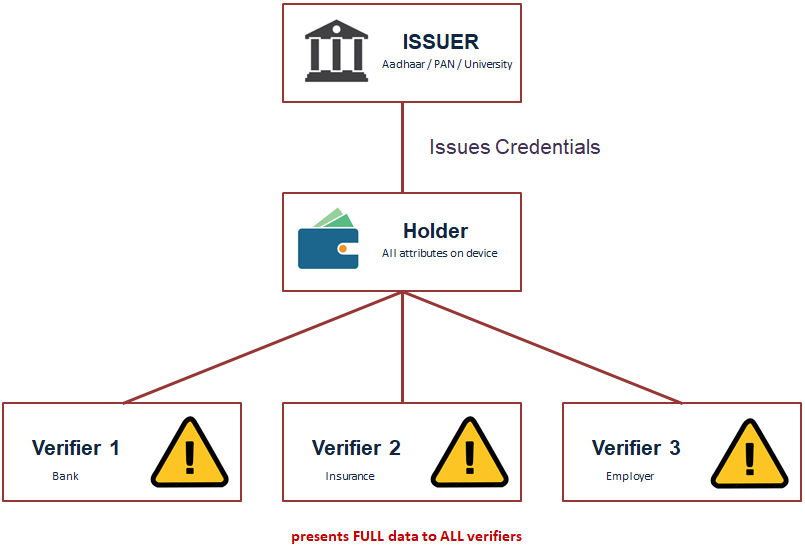

**Overview**

In the centralized identity model, a trusted authority (e.g., government, institution, or service provider) stores and manages user credentials. During verification, the verifier directly queries, or relies on, this centralized authority to validate user information.

**Privacy Impact:** 

In such systems, verification typically requires the disclosure of complete or excessive user data, even when only a specific attribute is required.

- Users reveal more information than necessary
- Multiple verifications create a traceable data trail across services
- Central authorities become single points of surveillance and control

This leads to a fundamental privacy issue:

   *Each verification leaks unnecessary information, enabling cross-service tracking and profiling.*

**Key Limitation**

This model inherently violates the principle of data minimization, as it discloses full identity information even when only a single attribute needs to be verified.

---

## Why Conventional Techniques Fail?

### Approach 1: Direct Document Sharing

**User (has identity documents) → scans (creates digital copies) → sends (uploads to verifier) → verifier (receives and stores all data)**

### Problems with This Approach

  - **Full data exposure:** Every field and document is unnecessarily disclosed
  - **Uncontrolled storage:** Documents may be stored indefinitely without user consent
  - **Forgery risk:** Verifiers cannot cryptographically verify authenticity
  - **No selective disclosure:** Users cannot reveal only specific attributes
  - **Cross-verifier correlation:** Identical documents enable tracking across services
  - **Loss of user control:** Users lose control once the data leaves their possession
    
---

### Approach 2: Centralized Identity (OAuth / SSO)

   

### Problems

  - **Single point of failure:** A single breach can expose all user data
  - **Global visibility:** Identity providers can observe user activity across services
  - **Session linkability:** User sessions can be correlated over time
  - **Trust concentration:** Control is centralized in a single authority
  - **Coercion risk:** Providers may be compelled by governments or courts
  - **Vendor lock-in:** Dependence on a single provider introduces long-term risk
    
---

## Key Failures of Conventional Systems

- Cannot prevent over-disclosure (Verifier always gets more than needed)
- Cannot prevent linkability (Credential fingerprint enables correlation)
- Cannot survive collusion (Combined data creates full profile)
- Trust model is broken (Central parties become surveillance nodes)

---

## The Multi-Verifier Nightmare

Suppose a user interacts with multiple services (e.g., 8 services within a month). Each interaction leaves behind a traceable data footprint across systems.

   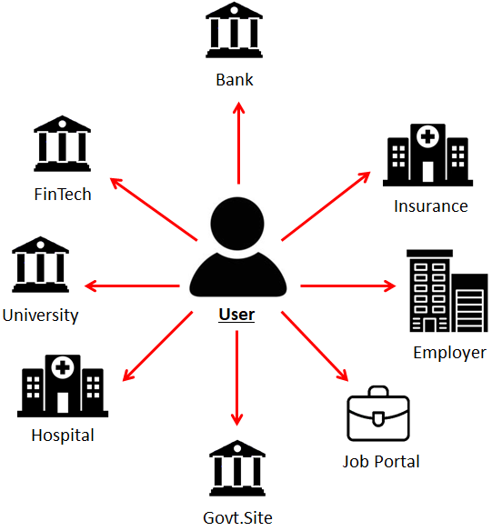

### Privacy Risks

 - **Profile construction:** Aggregated interactions enable the construction of detailed user profiles
 - **Data correlation:** Information can be combined with external datasets to derive deeper insights
 - **Data sharing and monetization:** Collected data may be shared or sold without user control
 - **Cross-system linkability:** Activities across different services can be linked and tracked
 - **Inference attacks:** Sensitive or hidden attributes can be inferred from partial disclosures
   
### Key Insight

**Repeated interactions across multiple verifiers transform small disclosures into comprehensive user profiling.**

---

### Attack Scenario: The Correlation Attack

Suppose a user presents the same credential to a bank (Day 1) and an insurance provider (Day 5).

1. User → presents credential to Bank (Bank records: session ID #A1, timestamp, credential fingerprint FP)
2. User → presents same credential to Insurance (Insurance records: session ID #B5, timestamp, credential fingerprint FP)
3. The bank and insurance provider share session data (e.g., via internal data-sharing agreements or a common parent organization).
4. **Correlation found...** The shared data reveals that the same fingerprint appears in both records: FPBank = FPInsurance ⇒ Both interactions are linked to the same user
5. Profiles merged across institutions (Bank now knows: User applied for insurance. Insurance knows: User has a loan.)
6. Privacy Compromised (Risk scoring without consent → higher premiums or denial of services, targeted advertising and behavioral profiling)

**Root Cause:** The credential fingerprint remains identical across multiple presentations, making the user trivially linkable across verifiers.

### Security Insight

**Even without revealing explicit identity attributes, deterministic identifiers (such as static fingerprints) enable cross-system correlation and effectively break user privacy.**

---

### Attack: The Replay Attack

**DEFINITION:**  A replay attack occurs when an adversary captures a valid credential presentation generated by a legitimate user and later reuses it to impersonate the user to a different verifier

Let:

- α = secret attribute (user’s private data)
- C = gαhβ = commitment
- π = zero-knowledge proof generated from C
- σ = credential presentation
- V = verifier

A credential presentation is defined as:

σ = (π, metadata)

where metadata may include issuer information, schema references, and credential fingerprint but does not include any session-specific randomness in this insecure design.

**Attack Description**

1. **User:** Generates a valid credential presentation σ and sends it to Verifier A (e.g., a bank)
2. **Verifier A (Malicious):** Accepts the presentation and secretly stores a copy of σ without the user’s knowledge for later use.
3. **Attacker / Malicious Verifier (Replay):** At a later time, the adversary reuses the same captured presentation σ and sends it to Verifier B (e.g., an insurance provider), impersonating the original user
4. **Verifier B (Honest):** Verifier B performs standard verification by:
   - Verifying the proof π
   - Checking credential validity
     
   Since the proof remains valid, Verifier B accepts the presentation, failing to detect that it is a replay. The attacker successfully impersonates the user.

**WHY IT WORKS:** The replay attack succeeds due to the absence of contextual binding in the proof generation process:

- No verifier-specific binding
- No session-specific challenge (nonce)
- No timestamp or freshness guarantee

As a result:

   **π is not bound to a specific session or verifier and is therefore reusable**

This lack of binding violates the freshness, non-transferability, and context-binding requirements of secure authentication, thereby making the system vulnerable to replay attacks.

**Preventing Replay Attacks:**

To mitigate replay attacks, proofs must be bound to a specific session and verifier.

1. **Verifier Challenge (Nonce):**

   The verifier generates a fresh random challenge:

   c ← {0,1}λ

   where λ is the security parameter.

2. **Context-Bound Proof Generation:**

   The user generates the proof as:

   π = ZKP(α; c, V)

   where:

   - c = session-specific nonce

   - V = verifier identity
  

3. **Security Guarantee:**

- Each proof becomes unique per session
- Replayed presentations fail verification
- Impersonation is prevented

This ensures non-transferability and freshness of the proof.

A replay attack is not a failure of cryptography itself, but a failure of context binding. Without incorporating freshness and verifier identity into the proof, even a perfectly valid zero-knowledge proof becomes reusable—and therefore insecure.

---

### Attack: Verifier Collusion

**Scenario:** Two honest-but-curious verifiers follow the protocol correctly during interaction but collude after verification by sharing collected data. Both entities belong to the same parent organization or a data-sharing ecosystem.

### Information Held by Each Verifier

**Bank (Financial View):**

- Income (₹12 LPA)
- Monthly spending patterns
- EMI obligations
- Loan application history
- Credit card usage

**Insurance Provider (Health & Risk View):**

- Age (24)
- Non-smoker status
- Health conditions
- Family medical history
- Previous insurance claims

**Collusion Outcome:**

Financial Data + Health Data  ⇒  Unified User Profile

### Privacy Impact

Without the user’s knowledge or consent, the combined dataset enables:

- **Complete user profiling:** Financial and health dimensions are merged
- **Automated risk scoring:** Cross-domain inference improves predictive accuracy
- **Adverse decision-making:** Higher premiums, loan denial, or service restrictions
- **Behavioral targeting:** Personalized manipulation and targeted advertising

### Key Observation

**Each verifier individually learns partial information, but collusion transforms fragmented data into a complete and highly sensitive user profile.**

### Root Cause

The system lacks **data isolation and unlinkability guarantees** across verifiers, allowing independently collected attributes to be combined.

---

### Attack: Linkability Attack

**DEFINITION:** Correlation of a user’s identity across multiple independent verification sessions.

**MECHANISM:** Verifiers compare deterministic identifiers such as credential signatures or hashes across sessions.

 ### Privacy Impact

- Cross-service tracking of user activity
- Construction of long-term behavioral profiles
- Loss of anonymity across independent interactions

### Root Cause

The use of static or deterministic identifiers across presentations enables trivial linkage of sessions.

---

### Attack:  Metadata Leakage

**DEFINITION:** Inference of user identity through auxiliary information such as timing, IP address, or device fingerprints.

**MECHANISM:** Side-channel signals—independent of credential content—are analyzed and correlated across sessions.

### Privacy Impact

- Re-identification without accessing credential data
- Location and behavior tracking
- Linking otherwise unlinkable sessions

### Root Cause

Lack of network-layer and contextual privacy protections, allowing metadata to act as an identifier.

---

### Attack:  Issuer Tracking

**DEFINITION:** The issuer tracks when and where a credential it issued is presented.

**MECHANISM:** 
- Back-channel communication between verifier and issuer
- Use of credential serial numbers or identifiers

### Privacy Impact
- Global visibility of user activity by the issuer
- Centralized tracking across all verifiers
- Complete loss of user autonomy and anonymity

### Root Cause

The system design allows issuer-observable identifiers or verification dependencies, breaking issuer unlinkability.

---

## System Model

The framework operates in a distributed setting involving four primary entities:

- **Issuer**: An authority that attests to and vouches for the correctness of a holder’s attributes by issuing cryptographically signed credentials.

  > The issuer is a trusted authority, whose attestations carry verifiable cryptographic integrity.

    **Examples:**

      - Government (Aadhaar, PAN Card, Passport)
      - University (Degree certificates, transcripts)
      - Employer (Employment proof, salary slips)
      - Bank (Income statements, KYC records)

- **Holder (Prover)**: The individual who possesses private attributes α and must prove specific claims about them to verifiers using zero-knowledge proofs.
  
  **KEY CHALLENGES USER FACES:**

   - **Over-disclosure:** Must reveal more information than required
   - **Loss of control:** Cannot control storage, reuse, or sharing of disclosed data
   - **Repeated exposure:** Same sensitive attributes shared across multiple verifiers
   - **No misuse guarantees:** No cryptographic protection against data aggregation or re-sharing

- **Verifier**: Entities that need to validate specific predicates over user attributes (e.g., α>18), but in conventional systems receive excessive information.

   **Here's the disparity: Required vs. Disclosed Information**

   | VERIFIER | WHAT THEY NEED | WHAT THEY GET |
   |----------|----------------|---------------|
   | Bank     | Income > ₹5 LPA  (1 bit: YES/NO) | Full salary slips + bank statements + PAN + transaction history |
   | Insurance Co. | Age ≥ 18 + Non-smoker  (2 bits) | Complete medical records + full health history + family conditions |
   | Job Portal | Has M.Tech degree  (1 bit: YES/NO) | Entire academic transcript + grades + institute + faculty references |

  > **Observation:** The required information is minimal (often a few bits), whereas the disclosed data is extensive.
  
  > **Data Amplification Problem:** The ratio of data required to data disclosed is typically 1:100 or worse, representing a fundamental privacy inefficiency. This is the core problem addressed by zero-knowledge proofs.

- **Revocation Authority**: An entity responsible for maintaining the revocation state of credentials (e.g., revoked, expired, or invalid credentials).

## Cryptographic Model

Let:

- **α** denote the user’s secret attributes
- **β** denote randomness
- **C = gα hβ** be a commitment
- **π** denote a zero-knowledge proof generated from C
- **σ** denote a credential presentation
- **c** denote a verifier challenge (nonce)
- **V** denote verifier identity
- **λ** denote the security parameter
  
The system ensures: 

- **Correctness:** Only valid statements about α are accepted
- **Privacy (Zero-Knowledge):** No additional information about α is revealed
- **Unlinkability:** Presentations σ across sessions cannot be correlated
- **Replay Resistance:** Proofs π are bound to c and V
- **Collusion Resistance:** Independent verifiers cannot combine data to reconstruct full profiles
  
---

### What Would a Proper Solution Look Like?

A privacy-preserving credential system must satisfy the following fundamental requirements:

- **Selective Disclosure:** The system must allow a user to prove a specific fact about α (e.g., α>18) without revealing the underlying attribute.
- **Unlinkability:** Credential presentations σ across multiple verifiers must be cryptographically unlinkable, preventing correlation across sessions.
- **Adversarial Robustness:** The system must remain secure against honest-but-curious verifiers who follow the protocol but attempt to infer additional information.
- **Collusion Resistance:** Privacy must be preserved even if multiple verifiers collude and share data, ensuring no reconstruction of the full attribute set.

---

## ZKP: Formal Definition & Three Properties

**DEFINITION:**
A Zero-Knowledge Proof (ZKP) is an interactive (or non-interactive) protocol between a Prover (P) and a Verifier (V), whereby the prover convinces the verifier that a statement **x ∈ L** is true, without revealing any information beyond the validity of the statement.

- **COMPLETENESS:** If the statement **x∈L** is true, an honest prover P can convince an honest verifier V with probability 1:

  Pr[V accepts P(x)] = 1
  
- **SOUNDNESS:** If the statement is false, no cheating prover P* can convince the verifier, except with negligible probability ε:

  Pr[V accepts P*(x)] ≤ ε

  where ε is negligible in the security parameter λ.
  
- **ZERO-KNOWLEDGE:** The verifier learns nothing beyond the truth of the statement. Formally, there exists a simulator Sim such that:

  ViewV(P,x) ≈ Sim(x)

  i.e., the verifier’s view during the interaction is computationally indistinguishable from a simulated transcript generated without access to the witness.
   

## Core Components

### 1. Issuer

The issuer is responsible for credential generation and cryptographic binding of user attributes. It does not participate in individual proof (presentation) sessions.

**Credential Issuance:**

The issuer generates a credential:

σ = Sign(sk, C)

where:

**sk** is the issuer’s signing key
**C = gα hβ** is a commitment to the user’s attributes

> Issuance is a one-time process and can be performed offline.

Examples: Aadhaar Authority, Universities, Employers

**Issuer Responsibilities:**

- Constructs **Pedersen commitments** \( C = g^α h^β \) ensuring hiding (privacy) and binding (integrity)
- Signs the commitment C using a secure signature scheme (e.g., Schnorr)
- Issues a verifiable credential (VC) bound to the committed attributes
- Guarantees authenticity and integrity without revealing the underlying attributes α

**Security Properties:**

- **Issuer does not learn usage patterns:** No involvement in presentation phase, no tracking
- **Attribute privacy preserved:** Only commitments C are signed, not raw attributes
- **Unforgeability:** Credentials cannot be created without the issuer’s secret key
  
> The issuer acts as a root of trust, whose correctness is assumed but whose visibility into user activity is strictly minimized.

---

### 2. Holder (Prover)

Holds the credential. Generates a ZKP to prove a specific predicate without revealing the underlying value.

π = Prove(pk, witness, x)

Chooses WHICH predicate to prove

Controls entire disclosure

- Securely stores credentials and associated secrets  
- Generates **non-interactive zero-knowledge proofs** via the Fiat–Shamir transformation  
- Proves predicates \( f(m) = 1 \) without revealing \( m \)  
- Derives **domain-scoped pseudonyms** to prevent cross-verifier correlation  
- Ensures full confidentiality of raw attributes  

The holder retains complete control over disclosure, addressing limitations of traditional identity systems.

---

### 3. Verifier

The verifier Receives the ZKP verifies its mathematical validity while learning nothing beyond their validity (Gets only a YES/NO - never raw data).

b = Verify(vk, π, x) → {0,1}

Cannot extract attribute value

Cannot link across sessions

- Verifies issuer signatures on commitments  
- Validates zero-knowledge proofs for correctness and soundness  
- Checks domain-specific pseudonyms for session consistency  
- Enforces **replay protection** via nonce-based challenge binding  
- Accepts or rejects proofs without accessing underlying attributes  

The verifier operates under an **honest-but-curious model**, attempting to learn additional information without deviating from the protocol.

   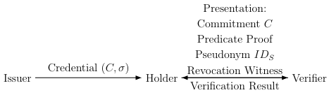

<b><em>Figure 1: Message flow during authentication session.</em></b>

---

### 4. Revocation Authority

The revocation authority manages credential invalidation.

- Maintains a dynamic set of revoked credentials  
- Uses an **RSA accumulator** for compact representation  
- Supports **constant-size non-membership proofs**  
- Ensures verification complexity independent of revocation set size  

While RSA accumulators provide strong efficiency, alternative constructions such as **Merkle accumulators and vector commitments** offer improved transparency and potential post-quantum compatibility.

---

# Cryptographic Foundations

This section presents the formal cryptographic primitives and protocols that enable privacy-preserving, secure, and unlinkable credential verification in the system.

The construction combines:

- Commitment schemes (Pedersen)
- Sigma protocols (Zero-Knowledge Proofs)
- Fiat–Shamir transformation (NIZK)
- Accumulator-based revocation
- Secure computation principles

---

## Commitment Scheme

**A commitment scheme allows a sender to commit to a value while keeping it hidden, with the ability to reveal it later.**

### Formal Definition

A commit ment scheme is tuple Γ = (𝑠𝑒𝑡𝑢𝑝, 𝐶𝑜𝑚𝑚𝑖𝑡, 𝑂𝑝𝑒𝑛) where:
- S𝑒𝑡𝑢𝑝(1λ) → pp : It takes security parameter 𝜆 and generates the public parameters 𝑝𝑝
- 𝐶𝑜𝑚𝑚𝑖𝑡(𝑝𝑝, 𝑚) → (𝐶, 𝑟) : Takes a secret message 𝑚 and output a public commitment 𝐶 and (optionally) a secret opening hint 𝑟 (which might or might not be the randomness used in the computation)
- 𝑂𝑝𝑒𝑛(𝑝𝑝, 𝐶, 𝑚, 𝑟) → b ∈{0,1} Verifies the opening of the commitment 𝐶 to the message 𝑚 provided with the opening hint 𝑟. S compute a commitment c of m and send it to R
  
---

### Basic Idea

**Two entities:** A sender S and a receiver R
- A commitment phase → protocol Com
- An opening phase → protocol Open
  
S has a private message m which it want to commit to R

   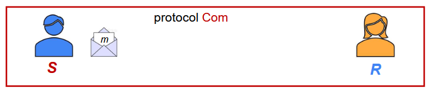

<b><em>Figure 2: Basic structure of a commitment scheme showing sender (S) and receiver (R)</em></b>

---

### Commitment Phase (Com)

- Sender commits to a message 'm'
- Computes commitment 'c' of 'm' and send it to receiver (R)

   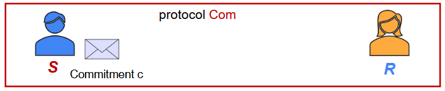

<b><em>Figure 3: Commitment phase where the sender computes and sends commitment c without revealing message m</em></b>

- Sends 'c' to receiver
- Message remains hidden

   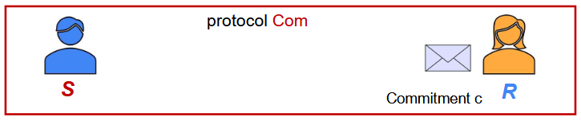

<b><em>Figure 4: The receiver receives the commitment c from the sender</em></b>

---

### Opening Phase (Open)

- Sender reveals '(m,r)'
- Receiver verifies commitment
- If valid then accept

   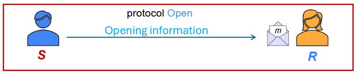

<b><em>Figure 5: Opening phase where the sender reveals (m,r) and the receiver verifies correctness</em></b>

---

### Security

**Hiding:** A 𝑐𝑜𝑚𝑚𝑖𝑡𝑚𝑒𝑛𝑡 𝑠𝑐ℎ𝑒𝑚𝑒 Γ is hiding if for any polynomial-time asversary 𝐴 the following probability is negligible in 𝜆:

   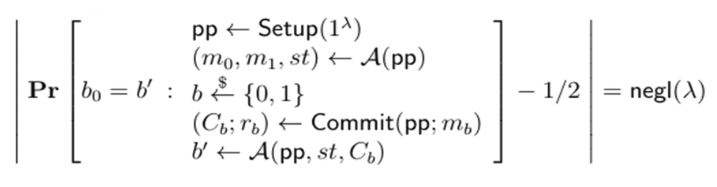

**Binding:** A 𝑐𝑜𝑚𝑚𝑖𝑡𝑚𝑒𝑛𝑡 𝑠𝑐ℎ𝑒𝑚𝑒 Γ is binding if for any polynomial-time asversary 𝐴 the following probability is negligible in 𝜆:

   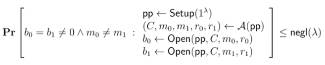

---

## Mathematical Background

Representation of a group element relative to a Generator and a Random group element :
Given a prime order cyclic group 𝔾 = <𝑔> , generated by 𝑔 of order 𝑞 and a uniformly random element ℎ ∈r 𝔾

For any 𝑢 ∈ 𝔾 a pair (𝛼, 𝛽) ∈ ℤq2 is called representation of 𝑢, relative to 𝑔 and ℎ, if 𝑢 = 𝑔𝛼 ℎ𝛽.

**Fact 1:** For any 𝑢 ∈ 𝔾, there exist 𝑞 distinct representation of 𝑢 relative to g and h.
- For every 𝛽 ∈ ℤq, there a unique 𝛼 ∈ ℤq, such that 𝑔𝛼 = 𝑢(ℎ𝛽)-1 holds

**Fact 2:** Given two distinct representation (𝛼,𝛽) ≠ (𝛼',𝛽') of any 𝑢 ∈ 𝔾 relative to 𝑔 and ℎ one can efficiently compute 𝐷𝐿𝑜𝑔gℎ
- 𝑢 = 𝑔𝛼 ℎ𝛽 and 𝑢 = 𝑔𝛼' ℎ𝛽' imply 𝑔𝛼-𝛼' = ℎ𝛽'-𝛽 since (𝛼,𝛽) ≠ (𝛼',𝛽')
- 𝛽'-𝛽 ≠ 0       Then (𝛽'-𝛽)-1 exist and say Δ
- Else 𝛼-𝛼' = 0  So g[𝛼-𝛼']Δ = h ⇒ DLoggh = (𝛼-𝛼')Δ

---

## Pedersen Commitment Scheme

**Gole:** Provably Secure commitment scheme for the message space 𝓜= ℤq and randomness space 𝓡= ℤq

                                            𝑃𝑒𝑑𝐶𝑜𝑚 = (𝑆𝑒𝑡𝑢𝑝, 𝐶𝑜𝑚𝑚𝑖𝑡, 𝑂𝑝𝑒𝑛)

𝑆𝑒𝑡𝑢𝑝(1λ) → 𝑝𝑝: This is Public setup algorithm that generats a cyclic group 𝔾 = ⟨𝑔⟩ of order 𝑞 and a uniformly random element ℎ ∈r 𝔾

### Commitment Function

 C = g𝛼 h𝛽

- 𝛼 → message
- 𝛽 → randomness
- Provides **perfect hiding** and **computational binding**

                                                      𝑪𝒐𝒎𝒎𝒊𝒕(𝒑𝒑, 𝜶, 𝜷) → 𝑪

   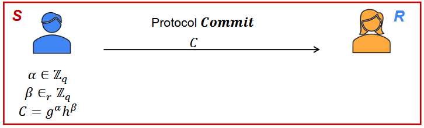

<b><em>Figure 6: Pedersen commitment generation using group generators g and h</em></b>

---

### Opening Function

                                                      𝑶𝒑𝒆𝒏(𝒑𝒑, 𝑪, 𝜶′, 𝜷′) → 𝐛

   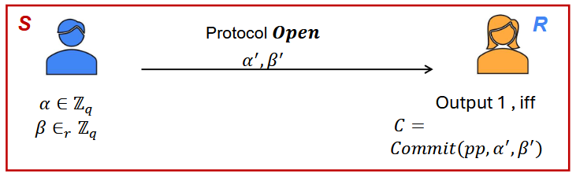

<b><em>Figure 7: Verification of Pedersen commitment by recomputing commitment using revealed values</em></b>

Receiver checks:

$C \stackrel{?}{=} g^{𝛼} h^{𝛽}$

If valid then Accept (1),  else Reject (0)

---

### Properties

**Binding Property:** If 𝐷𝐿𝑜𝑔 assumption is true in 𝔾, then the 𝑃𝑒𝑑𝐶𝑜𝑚 satisfy the binding property.
- Breaking the binding property for 𝑃𝑒𝑑𝐶𝑜𝑚 ⇒ computationally easy to find (𝛼, 𝛽) ≠ (𝛼', 𝛽′),
- such that 𝐶𝑜𝑚𝑚𝑖𝑡(𝛼, 𝛽) = 𝐶 = 𝐶𝑜𝑚𝑚𝑖𝑡(𝛼', 𝛽′) with a non-negligible probability ⇒ computationally easy to find 𝐷𝑙𝑜𝑔gℎ with a non-negligible probability.

**Hiding Property:** Function Ped𝐶𝑜𝑚 satisfies hinding property, even against a computationally unbounded adversary.

The element 𝐶 has a 𝑞 distinct represenations, relative to 𝑔 and ℎ, with each representation being equally probable.
- For every candidate message 𝛼b, there exist a unique randomness 𝛽b ∈ ℤq, such that 𝐶 = 𝐶𝑜𝑚𝑚𝑖𝑡(𝛼b, 𝛽b)
- Actually randomness 𝛽 is selectd uniformly from ℤq
- 𝑃𝑟[𝛼0 𝑖𝑠 𝑐𝑜𝑚𝑚𝑖𝑡𝑡𝑒𝑑 𝑖𝑛 𝐶] = 1/q =𝑃𝑟[𝛼1 𝑖𝑠 𝑐𝑜𝑚𝑚𝑖𝑡𝑡𝑒𝑑 𝑖𝑛 𝐶] ∀𝛼0, 𝛼1 ∈ ℤq

+ The Pederson Commitment scheme is **linearly-homomorphic**
  - Let 𝐶𝛼1,𝛽1 = 𝐶𝑜𝑚𝑚𝑖𝑡(𝛼1, 𝛽1) = 𝑔𝛼1 ℎ𝛽1
  - Let 𝐶𝛼2,𝛽2 = 𝐶𝑜𝑚𝑚𝑖𝑡(𝛼2, 𝛽2) = 𝑔𝛼2 ℎ𝛽2
  - Let c1,c2 ∈  ℤq

  (C𝛼1,𝛽1)c1 = (g𝛼1h𝛽1)c1 = gc1𝛼1hc1𝛽1 = Commit(c1𝛼1,c1𝛽1)

(C𝛼2,𝛽2)c2 = (g𝛼2h𝛽2)c2 = gc2𝛼2hc2𝛽2 = Commit(c2𝛼2,c2𝛽2)

Then (C𝛼1,𝛽1)c1 (C𝛼2,𝛽2)c2 = gc1𝛼1+c2𝛼2hc1𝛼1+c2𝛽2 = Commit(c1𝛼1+c2𝛼2,c1𝛼1+c2𝛽2)

- Any linear function of committed values can be computed locally by performing some operation on Commitments.

---

## Homomorphic Encryption

### **Motivation**
  
  - Need to compute on encrypted data
  - Protect data privacy in cloud computation
  - Enable secure outsourcing of computation
    
### **What is Homomorphic Encryption?**

- Encryption allowing computation on ciphertexts
- Operations on ciphertext translate to operations on plaintext
- Decrypt(result) = f(plaintexts)

**Definition:** Homomorphic Encryption is an encryption consist of stander algorithms HE = (KeyGen, Enc, Dec) with an additional evaluation algorithm 𝐸𝑣𝑎𝑙.
- If we have a function 𝑓 and ciphertext 𝑐1, 𝑐2, … , 𝑐n that encrypt message 𝑚1, 𝑚2, … , 𝑚n the scheme is homomorphic if
  
  𝐷𝑒𝑐(𝐸𝑣𝑎𝑙(𝑓, 𝑐1, 𝑐2, … , 𝑐n)) = 𝑓(𝑚1, 𝑚2, … , 𝑚n)
  
o 𝐸𝑛𝑐(𝑚1) ⊕ 𝐸𝑛𝑐(𝑚2) → 𝐸𝑛𝑐(𝑚1 + 𝑚2)

o 𝐸𝑛𝑐(𝑚1) ⊗ 𝐸𝑛c(𝑚2) → 𝐸𝑛𝑐(𝑚1 × 𝑚2)

o No need to decrypt during computation

### **Types of Homomorphic Encryption**
- Partially Homomorphic Encryption (PHE)
- Somewhat Homomorphic Encryption (SHE)
- Fully Homomorphic Encryption (FHE)

### **Partially Homomorphic Encryption(PHE)**

Partial homomorphic encryption permits for a particular sort of operation to be carried out on the encrypted information while keeping the encryption.

 **Example:**
- **Additive Homomorphism:** This allows for addition encrypted values. Given encrypted values '𝐸𝑛𝑐(𝑎)' and '𝐸𝑛𝑐(𝑏)', you could compute '𝐸𝑛𝑐(𝑎 + 𝑏)' without decryption.
- **Multiplicative Homomorphism:** This enables multiplication of encrypted values. Given encrypted values '𝐸𝑛𝑐(𝑎)' and '𝐸𝑛𝑐(𝑏)', you could compute '𝐸𝑛𝑐(𝑎 ∗ 𝑏)' with out decryption.

### **Somewhat Homomorphic Encryption (SHE)**

Somewhat homomorphic encryption permits for a limited wide variety of operations to be carried out on encrypted statistics.
 
 **Example:**
- SHE schemes include the Paillier cryptosystem, which helps additive homomorphism

### **Fully Homomorphic Encryption (FHE)**

Fully homomorphic encryption is the maximum powerful type, allowing for both addition and multiplication operations on encrypted information.
 
 **Example:**
  - Gentry-BGV scheme and the Dijk-Gentry-Halevi-Vaikuntanathan (DGHV) scheme.

### **Appltcation**
- Secure cloud computing
- Private machine learning
- Electronic voting
- Privacy-preserving data analytics

### **Challenges**
- High computational overhead
-  Large ciphertext size
- Complex parameter tuning

### **Examples**
 **ElGamal Encryption:** EE = (KayGen, Enc, Dec)
- Let 𝔾 = ⟨𝑔⟩ be a cyclic group of order 𝑞.
- 𝐾𝑒𝑦𝐺𝑒𝑛(1λ) → (𝑝𝑘, 𝑠𝑘): 𝑠𝑘 ← $ ℤq , 𝑝𝑘 = 𝑔sk
- For 𝑚 ∈ 𝔾, 𝐸𝑛𝑐(𝑚, 𝑝𝑘) → 𝐶: 𝑟 ← $ ℤq, 𝑐1 = 𝑔r, 𝑐2 =𝑚. 𝑝𝑘r, 𝐶 = (𝑐1, 𝑐2)
- 𝐷𝑒𝑐(𝐶, 𝑠𝑘) → 𝑚: 𝑚 = c2/c1sk</sk>

 **Homomorphic Property:**
- ElGamal is multiplicatively homomorphic
- 𝐸𝑛𝑐(𝑚1, 𝑝𝑘) = (𝑔r1, 𝑚1 · 𝑝𝑘r1)
- 𝐸𝑛𝑐(𝑚2, 𝑝𝑘) = (𝑔r2, 𝑚2 · 𝑝𝑘r2)

Component-wise multiplication gives:
- (𝑔(r1+r2) , 𝑚1. 𝑚2 · 𝑝𝑘(r1+r2)) = 𝐸𝑛𝑐(𝑚1 · 𝑚2)

---

# Zero-Knowledge Proof (ZKP)

Zero-knowledge proof (ZKP) is a cryptographic method used to prove knowledge about a secret data, without revealing the data itself.

## Properties
- Completeness : An honest prover succeeds in convincing the verifier.
- Soundness : A corrupt prover (without witness) fails with high probability.
- Zero-Knowledge : A corrupt verifier fails to learn more from the proof.
- Knowledge Soundness : If P succeeds, ∃ a PPT algorithm Ext that can ‘extract’ the witness.

## ZKP System Flow - Five Phases

The protocol follows a 3-step interaction:

1. **SETUP (Trusted Parameters):**
   
    - Generate CRS / SRS
    - Proving key (pk)
    - Verif. key (vk)
    - Done once globally
      
2. **ISSUE (Credential Issuance):**
   
    - Issuer signs attributes
    - σ = Sign(sk, attrs)
    - User stores σ
    - Offline - happens once
      
3. **PROVE (Proof Generation):**
    
    - Select predicate p
    - π = Prove(pk, w, x)
    - w = secret witness
    - Runs on User's device
      
4. **TRANSMIT (Send Proof Only):**

    - Send only π to verifier
    - No raw data
    - Session-nonce bound
      
5. **VERIFY (Proof Verification):**

    - b = Verify(vk, π, x)
    - Outputs: {0, 1}
    - No witness revealed
    - Session-nonce bound
    - User stays unlinkable

User participates in phases 2–4 only. Verifier never sees her witness. Issuer not involved in phases 3–5

## Key Concepts: Witness, Statement & Relation

- **Statement (x)** → The PUBLIC CLAIM the prover wants to prove is true [x ∈ L  (language membership)]
  
   **Example:**
  
      x = "income > ₹5 LPA"
  
      "age ≥ 18", "has M.Tech degree"
  
   Public - shared with verifier
  
   Boolean: true or false
  
   The ONLY thing verifier learn
  
- **Witness (w)** → The SECRET data the prover knows but does NOT reveal (w ∈ Witness(L, x))

  **Example:**
  
      w = Priya's income ₹12 LPA
  
      The Aadhaar number, age, credential σ
  
  Private - only prover knows w
  
  Used internally in Prove()
  
  Never transmitted to verifie
  
- **Relation (R)** → The COMPUTATION relating witness to statement, encoded as arithmetic gates (R(w, x) = 1  iff claim holds) [R(w, x) = b]

  **Example:**
  
      R(w=12, x=5) → 12>5 → 1
  
      Encoded as R1CS / Plonkish constraints

  
      Defines the allowed check
  
      Fixed per predicate type
  
      Compiled once, verified many times

Prove:

"I know w such that R(x, w) = 1"

**Verifier knows only x and b - never w**

---

## Fiat–Shamir Transformation (NIZK)

**INTERACTIVE ZKP:** Requires multiple rounds of communication between the prover and verifier where the verifier sends challenges to the prover and receives his responses

  - Requires both parties (Prover and Verifier) ONLINE simultaneously
    
  - Does not scale to async internet use
    
  - Simpler to analyze formally

**NON-INTERACTIVE ZKP (NIZK):** a single message from prover to verifier; the verifier can check proof independently (used for trustless verification ondecentralized system)

 - No simultaneous online requirement
   
 - Scales to web and mobile
   
 - Basis: zk-SNARKs, zk-STARKs, Bulletproofs

**Fiat–Shamir Heuristic:**  replace challenge with H(commitment)

Interactive ZKP can be transformed into a **Non-Interactive Zero-Knowledge Proof (NIZK)** using a cryptographic hash function:

\[
c = H(t)
\]

This eliminates interaction, making proofs:

- Publicly verifiable  
- Suitable for blockchain systems  
- Efficient for distributed environments

**Setup:**

Public CRS/SRS generated once (trusted setup or transparent)

**Holder:** 

π = Prove(pk, w, x) → single artifact, no interaction

**Verifier:**

b = Verify(vk, π, x) → {0,1} async, offline OK

---

## ZKP vs. Traditional: Head-to-Head

   | REQUIREMENT | TRADITIONAL | ZKP SYSTEM |
   |-------------|-------------|------------|
   | Data shared with verifier | Full credential / document | Proof π only |            
   | Linkability across sessions |  Same ID → trivially linkable | Fresh random proof each time |             
   | Collusion survivability | Profiles merge easily | No data to merge -only bits |
   | Attribute selectivity | All-or-nothing disclosure | Prove any predicate you choose |
   | Verifier trust requirement | Must trust verifier's storage | No trust needed -math verifie 
   | Replay protection | Credential can be replayed | Nonce binding prevents replay |
   | Issuer involvement per use | Often required each time | One-time issuance, infinite proofs |
   
---

## ZKP Properties

- Proves knowledge without revealing underlying data - Zero-Knowledge property - (Goldwasser–Micali-Rackoff 1985)
- Honest prover always convinces verifier - Completeness - Pr[V accepts] = 1
- Cheating prover cannot produce valid proof - Soundness - Pr[V accepts false] ≤ ε
- Each proof unlinkable across different verifiers - Simulation-based unlinkability - Fresh randomness
- Non-interactive -single proof artifact - NIZK via Fiat-Shamir - Random oracle model
- Selective disclosure of individual attributes - Predicate proofs per attribute - Circuit per predicate
- Withstands honest-but-curious adversaries - Computational ZK - View simulatability
- Prevents verifier acting on the verified result - (policy layer - out of scope) - Legal / contractual

---

# Sigma Protocol (Σ-Protocol)

Sigma protocols are a class of **3-move public-coin Zero-Knowledge Proofs** characterized by their simple and efficient structure:

\[
Commit → Challenge → Response
\]

1. **Commitment (t):** Prover computes a commitment using randomness and secret witness.

3. **Challenge (c):** Verifier sends a random challenge (public-coin model).

4. **Response (s):** Prover responds using both randomness and witness.

5. **Verification:** Verifier checks correctness → Accept / Reject.0

---

## Protocol Flow

  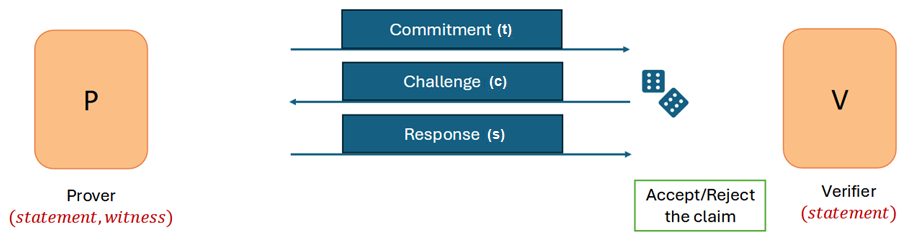

<b><em>Figure 8: Σ-Protocol structure for Zero-Knowledge Proof of knowledge</em></b>

---

## Example: Discrete Logarithm Proof

Let:

- Statement: \( y = g^w \)  
- Witness: \( w \)

### Steps:

- **Commitment:**  
  
  t = g^r
  

- **Challenge:**  

  c ∈ Zq
  

- **Response:**  
  
  s = r + c · w
  

- **Verification:**  

  gs ?= t · yc
  

   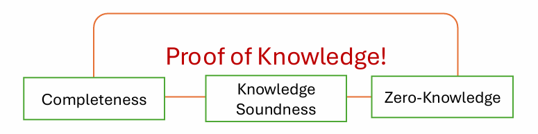

- Proof-size: 𝑂(𝑛)
- Verification complexity: 𝑂(𝑛)
  
---

## Security Guarantees

- **Completeness**  
  Honest prover always succeeds  

- **Special Soundness**  
  Two valid transcripts allow extraction of the witness  

- **Honest-Verifier Zero-Knowledge (HVZK)**  
  A simulator can generate indistinguishable transcripts  

---

## Advanced Capabilities

Sigma protocols support powerful constructions:

- **AND proofs** → prove multiple statements simultaneously
  

  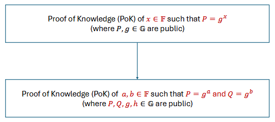
  

  

  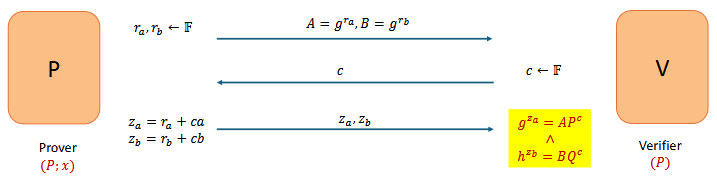
  

  
<b><em>Figure 9: Σ-Protocol for discrete log (AND)</em></b>

- **OR proofs** → prove knowledge of one among many
  

   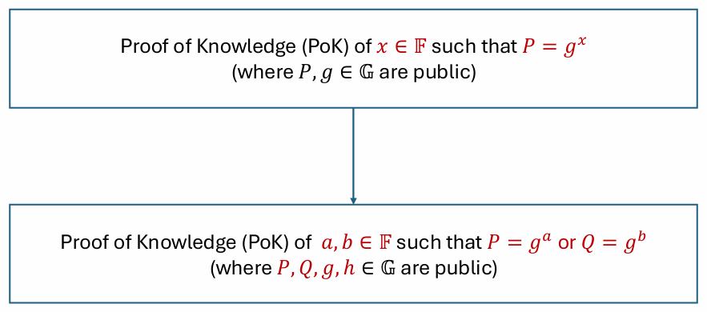

   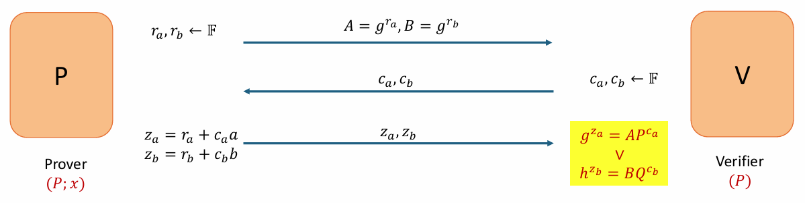

<b><em>Figure 10: Σ-Protocol for discrete log (OR)</em></b>

- **Vector proofs** → multi-attribute verification

  Proof of Knowledge (PoK) of 𝒙,𝛾∈𝔽 such that 𝑃=𝒈𝒙ℎ𝛾 (Note : 𝑃,𝑔,ℎ∈𝔾 are public) satisfies

  

   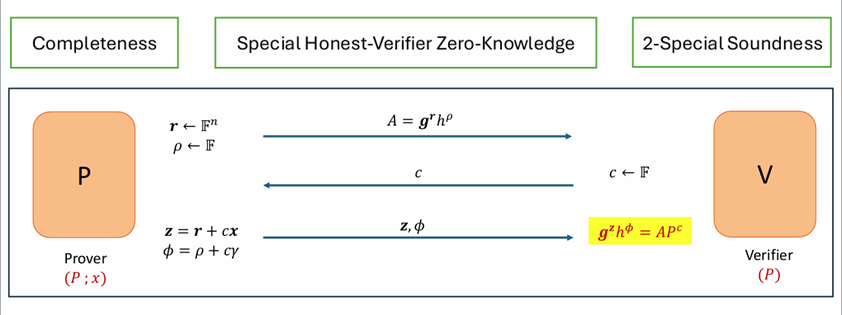

<b><em>Figure 11: Σ-Protocol for discrete log (vector)</em></b>

- **Proof compression** → reduced communication cost

---

# Major ZKP Protocols at a Glance

| PROTOCOL | TYPE | TRUSTED SETUP | PROOF SIZE | VERIFY SPEED | PQ-SECURE | BEST FOR |
|----------|------|---------------|------------|--------------|-----------|----------|
| Groth16 (2016) | zk-SNARK | YES | ~192 bytes | ~1 ms | NO | Ethereum L2, Zcash (Sapling) |
| PLONK (2019) | zk-SNARK | Universal | ~500 bytes | ~5 ms | NO | General circuits; Aztec, zkSync |
| zk-STARKs  (2018) | zk-STARK | NONE | 10–200 KB | ~50 ms | YES | StarkNet, StarkEx, post-quantum |
| BBS+ (2023) | Signature | CRS only | ~112 bytes | <1 ms | NO | W3C VC, multi-attribute selective disclosure |
| Bulletproofs (2017) | NIZK Range | NONE | ~1 KB | ~100 ms | NO | Monero (range proofs), confidential txns |

---

## Credential Lifecycle

1. **Credential Issuance**  
   The issuer commits to user attributes and signs them to produce a verifiable credential.

2. **Proof Generation**  
   The holder generates a zero-knowledge proof \( π \) demonstrating a predicate over committed attributes.

3. **Verification**  
   The verifier checks the validity of \( π \) without accessing sensitive data.

4. **Revocation Check**  
   The system verifies non-membership in the revocation accumulator.

5. **Audit Logging**  
   Successful verifications are recorded in a tamper-evident log for accountability.

---

## Issuer Trust Model

A fundamental deployment challenge is **scalable trust management for issuers**.

In real-world systems:
- The number of issuers grows dynamically  
- Maintaining static trust lists becomes infeasible  
- Manual inclusion is error-prone and non-scalable  

To address this, the system introduces a **tag-based trust abstraction**, where issuers are validated based on **trusted authority endorsements (e.g., government-backed credentials)**.

This approach:
- Eliminates reliance on exhaustive issuer lists  
- Enables dynamic and scalable trust  
- Aligns with real-world digital identity ecosystems  

---

## Privacy Motivation

Traditional identity architectures suffer from severe privacy limitations:

- **Over-disclosure**: Entire identity revealed for minimal requirements  
- **Linkability**: Repeated usage enables cross-service tracking  
- **Data accumulation**: Verifiers build user profiles over time  
- **Loss of control**: Users cannot restrict downstream data usage
- **Centralized control**: Identity providers observe user behavior    

These issues have been observed in real-world incidents involving centralized identity systems and large-scale data leaks.

This framework addresses these challenges through:

- **Selective disclosure via ZKPs**  
- **Scoped unlinkability across domains**  
- **Zero disclosure of raw attributes**  
- **Decentralized verification without identity exposure**

---

##  Real-World Failures

Every major breach below used a 'trusted' centralized identity or data system:

- Aadhaar data exposure incidents  
- Cambridge Analytica data misuse  
- Equifax large-scale data breach  

   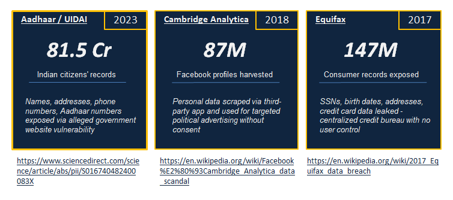

In all cases, users **lost control after sharing data**

---

## ZKP Security Model & Trust Assumptions

The system considers the following adversaries:

- **Honest-but-curious verifiers**  
- **Malicious provers (without valid witnesses)**  
- **Colluding verifiers attempting linkage**  
- **Replay attackers reusing proofs**  
- **Correlation attacks using metadata**

**TRUST ASSUMPTIONS**

   - Trusted Setup: CRS generated honestly (MPC ceremonies mitigate this)
   - Hardness: Security relies on computational hardness assumptions (DL, pairing)
   - Issuer honesty: Issuer correctly signs real attributes (policy, not ZKP)
   - Prover's device: Witness must remain secure on Priya's device
     
---

## Attacks Considered

The system is designed against:

- **Replay Attacks** → reuse of valid proofs  
- **Correlation Attacks** → linking across services  
- **Verifier Collusion** → cross-verifier tracking  
- **Metadata Leakage** → inference via auxiliary data  
- **Attribute Inference** → partial disclosure exploitation  

---

## Privacy and Security Guarantees

- **Selective Disclosure**  
  Only required attributes are proven
    
- **Attribute Privacy**  
  No information about \( m \) is revealed beyond the proven predicate  

- **Scoped Unlinkability**  
  Pseudonyms prevent cross-domain correlation  

- **Replay Resistance**  
  Proofs are bound to session-specific nonces  

- **Revocation Soundness**  
  Revoked credentials cannot produce valid proofs  

- **Cryptographic Integrity**  
  Security reduces to standard hardness assumptions  

---

## Limitations (WHAT ZKP DOES NOT SOLVE  (requires system design beyond ZKP))

ZKP does NOT inherently solve:

- Does NOT prevent verifier from acting on the result (e.g., denying a loan) - requires policy/law.
- Does NOT guarantee issuer signed correct attributes - requires trust in issuer.
- Does NOT prevent metadata leakage (IP address, timing) - requires network-layer anonymity (Tor, mixnets).  

These require **policy, governance, and network-layer solutions**

---

## Post-Quantum Considerations

While the current system relies on classical assumptions, it is designed for **future post-quantum migration**.

### What is Post Quantum Cryptography ?

**HARVEST NOW, DECRYPT LATER**

- Digital security is built on the 5 pillars– Confidentiality, Integrity, Availability, Authentication, Non-repudiation
- Encryption and Digital signature protocols ensure a secure network based on these pillars
- Security in the digital world is based on the mathematical hardness of the classical cryptographic algorithms– RSA and ECC

**Threat for RSA**

   - RSA is an asymmetric encryption algorithm
   - The public key is a 2048-bit integer and the private key is its prime factor
   - The computational complexity for prime factorization of any 𝑛-bit integer is, e𝑐+𝑜(1)(ln 𝑛)1/3 (ln ln 𝑛)2/3
   -  In 1994, Peter Shor presented an algorithm which can determine prime factors of an integer in real time on a powerful machine

**Threat for ECC**

   -  Elliptic curve cryptography is based on elliptic curve theory and Diffie-Hellman key exchange
   - The public key sizes are much smaller than RSA
   - The computational complexity lies in solving the discrete logarithm problem (DLP) in a large finite cyclic group, 𝐺 : given 𝑔,𝑝(𝑙𝑎𝑟𝑔𝑒𝑝𝑟𝑖𝑚𝑒) ,𝑔𝑎𝑚𝑜𝑑 𝑝, it isdifficult to find 𝑎.
   - Shor’s algorithm can make Ω(log|𝐺|) group operation queries in polynomial time

### Classical Cryptography vs Quantum Cryptography

 - Classical cryptography uses mathematically hard problems to derive security protocols to protect information
 - The mathematical hardness is defined with respect to the computational power of classical computers, which are based on 0/1 bit
 - The encryption or signature is generated using public/private key pairs which cannot be cracked in real time due to the low computing power of a classical computer
 - Aquantum computer is built on qubits which are dependent on quantum states
 - This increases the computational power by many folds, hence algorithms like Shor’s can be implemented in real time
 - This creates a risk to the existing classical cryptography

### Quantum Cryptography Timeline

- 2001 - researchers at IBM implemented Shor’s algorithm on a 7-qubit NMR computer
- 2011 – D-Wave systems claimed to produce first commercial quantum computer
- 2016 – IBM launched first cloud based quantum computing platform IBM-Q
- 2016–NIST initiated a standardization process to find quantum-safe algorithms for key exchange and signature
- 2020 to 2023 - Major advancements in building quantum machines with higher qubit count and error correction by IBM, Google, Microsoft
- 2025 – NIST standardized 3 protocols for key exchange and signature
- Q-Day–Experts say, a noise free quantum computer which can break a 2048 bit encryption, may be available as early as 2030

### Mosca’sTheorem

If X represents the number of years that data must be kept secure, and Y is the estimated time needed to complete the transition,then organizations must start transitioning to post quantum algorithms before X+Y exceeds the expected time Z for a cryptographically relevant quantum computer to be built.

**Alternative areas for post quantum cryptographic algorithms**

- **Lattice-based:**  Hard geometric challenge to find the shortest vector in a high dimensional lattice
- **Hash based:** Rely purely on the security of cryptographic hash functions
- **Codebased:** Difficulty of decoding random linear error-correcting codes
- **Multivariate based:** Solving complex systems of nonlinear equations
- **Isogeny based:** Elliptic curve theory

---

## Threat for Hash functions

- Hash functions, ℋ:𝑋 → {0,1}𝑛 map a message into a fixed length output so that, given the, ℋ(𝑥) it is hard to determine the pre-image in real time
- Searching the pre-image by brute force is of 𝑂(𝑛)
- In 1996, Lov Grover came up with an algorithm which reduces the search to 𝑂(𝑛)
- Advent of quantum computers would give rise to brute-force attacks and collision attacks due to this quadratic speed-up

| ZKP Protocols/Frameworks | Mathematical Primitive | Main feature of ZKP | Is it Quantum Secure? |
|--------------------------|------------------------|---------------------|-----------------------|
| 𝚺-protocol (like Schnorr) | Discrete log in cyclic group, G | Knowledge soundness | Broken by Shor |
| Fiat-Shamir NIZK | Cryptographic Hash function (ROM/QROM) | Non-interactivity | Grover reduces security |
| Pederson Commitment based ZK | Group exponentiation (DLP) | Perfect hiding, computational binding | Broken by Shor |
| Groth16 zk-SNARK | Bilinear pairing | Constant-size proof | Broken by Shor |
| PLONK | Polynomial commitments and pairing | Setup | Broken by Shor |
| Bulletproofs | Elliptic curve inner product | Logarithmic proof size | Broken by Shor |
| zk-STARK | Hash functions and polynomials | Transparent setup | Yes, if Hash is secure |
| MPC-in-the-Head ZK | Symmetric cryptography + secret sharing | Transparent zero knowledge | Yes, if Hash is secure |
| Lattice based ZK | LWE, SIS over  ℤ𝑞𝑛 | Post quantum soundness | Yes | 
| Merkle Tree based ZK | Collision resistant hash trees | Efficient commitments | Yes, if Hash is secure |

## Quantum migration of ZKP

**Possible replacements**

| Classical Component | PQ alternative |
|---------------------|----------------|
| Groth16 | Lattice based |
| PLONK | Hash based MPC-in the-Head |
| Pederson Commitment | SIS-based commitment |
| EC-DSA | ML-DSA |
| BLS Signatures | SLH-DSA |

## Challenges in Migration

- Hugecomputational overhead as key sizes are much larger compared to RSA/ECC algorithms
- Causes performance degradation
- Migration would be complex process
- Hardware acceleration requirements
- Increase in proof sizes and proving time
- Higher cost for verification

## Design Principles

- **Modularity**  
  Separation of cryptographic primitives and protocol layers  

- **Transparency**  
  No reliance on trusted setup or opaque proof systems  

- **Efficiency**  
  Millisecond-level verification under standard parameters  

- **Extensibility**  
  Compatible with decentralized identity and blockchain systems  

---

# Real-World Adoption

Zero-Knowledge technologies are actively deployed in:

- **Zcash - Shielded Transactions** → shielded transactions. [https://z.cash/] 
- **Polygon zkEVM / StarkNet** → scalable blockchain execution. [https://polygon.technology/polygon-zkevm]  
- **EU Digital Identity Wallet (EUDI)** → privacy-preserving identity. [https://en.wikipedia.org/wiki/EU_Digital_Identity_Wallet]
- **Google Wallet Age Verification** → selective disclosure (age verification). [https://blog.google/innovation-and-ai/technology/safety-security/opening-up-zero-knowledge-proof-technology-to-promote-privacy-in-age-assurance/]
- **MACI - Minimal Anti-Collusion Infrastructure** → Proves vote was cast and counted correctly without revealing the vote. Used in Gitcoin, ETH governance. [https://maci.pse.dev/]
- **ING / JP Morgan ZK Credit** → Proves credit score above threshold or AML compliance without sharing full financial records with counterparty. [https://www.coindesk.com/markets/2017/10/17/jpmorgan-integrates-zcash-privacy-tech-into-quorum-blockchain]

---

## Summary

This architecture demonstrates that **privacy-preserving, scalable identity verification** can be achieved using well-established cryptographic primitives combined with principled system design.

By integrating zero-knowledge proofs, commitment schemes, and accumulator-based revocation, the system achieves a balance between **privacy, efficiency, and deployability**.

Moreover, by addressing real-world challenges such as **issuer trust scalability, privacy limitations of traditional systems, adversarial threats, and post-quantum readiness**, the framework evolves from a theoretical construct into a **practical, future-ready identity infrastructure**.
